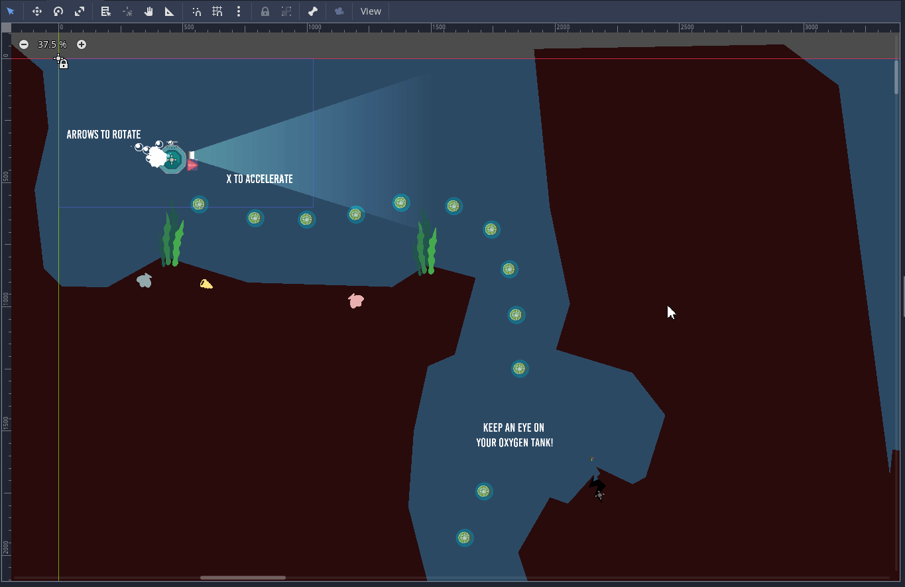
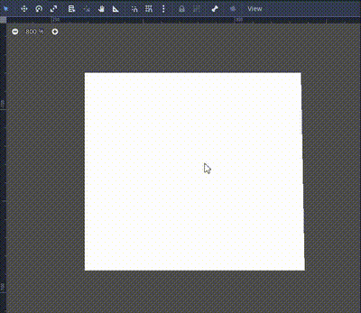
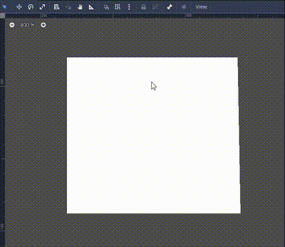
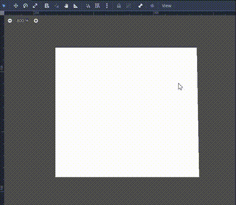
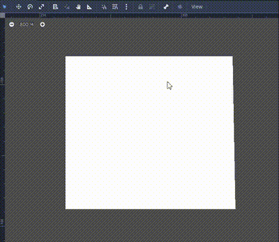
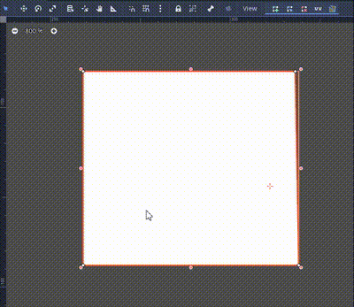
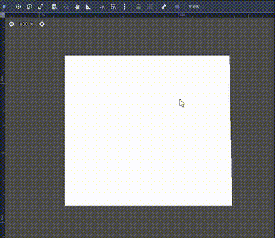

# Polygon Knife Tool
 Godot plugin that let users slice Polygon2D, NavigationRegion2D and CollisionPolygon2D nodes and scenes based on said nodes.
 
  This is the **Godot 4.x version** of the plugin, if you are using **Godot 3.x** [click here](https://github.com/mrkdji/knife-tool/tree/3.x).

- [Install Instructions](#install-instructions)
- [Usage](#usage)
- [What you can do with the knife tool:](#what-you-can-do-with-the-knife-tool)
- [What you can't do with the knife tool:](#what-you-cant-do-with-the-knife-tool)
- [Buy Me A Coffee](#buy-me-a-coffee)

## Install Instructions
Download and move the unzipped folder in your project addons folder.

If you use git you can also add it as a submodule:

`git submodule add https://github.com/mrkdji/knife-tool.git addons/knife-tool`

## Usage

|Action|Key|
|-|-|
|Add Point|left mouse click|
|Cancel Cut|right mouse click|
|Confirm Cut|enter / return|

## What you can do with the knife tool:
- Simple cut

- Cut with multiple inner points

- Multiple cuts at once

- Cuts that self-intersect (with a caveat)

## What you can't do with the knife tool:
- Carve holes

- Cuts that self-intersect inside the polygon:

## Buy Me A Coffee

If you find this tool useful ~~send me the munny~~ consider buying me a coffee:

